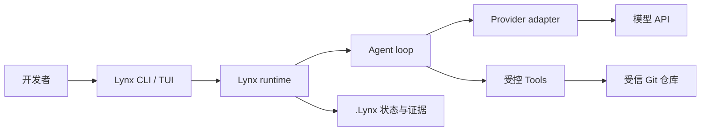
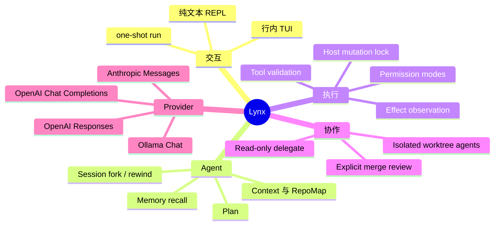
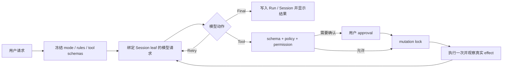
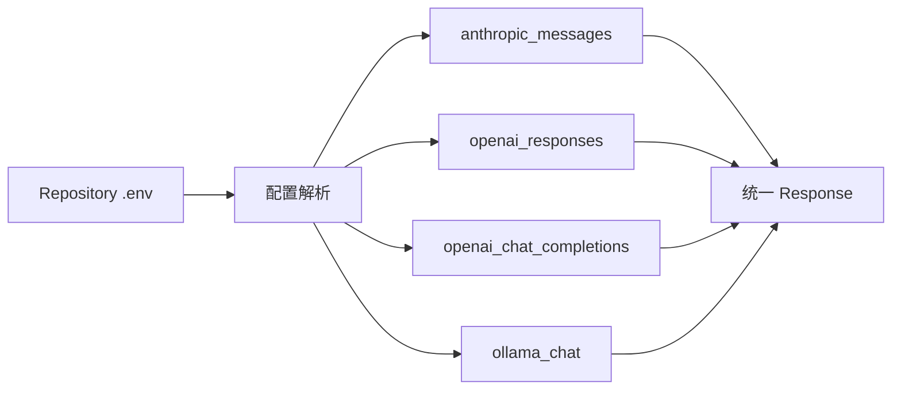
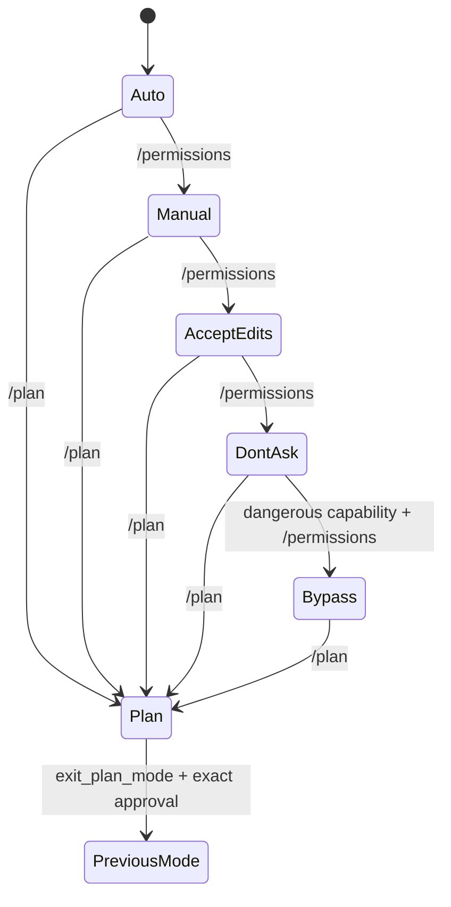
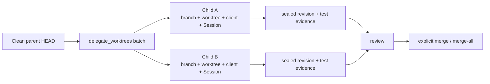
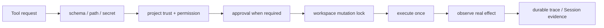
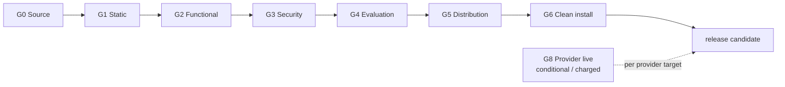

# LynxCode

> 面向受信代码仓库的本地 coding agent：理解上下文、受控地调用工具、保存可恢复的会话证据。

Lynx 是一个 Python CLI/TUI coding agent。它在当前 Git 仓库内构造上下文，由模型提出一个动作，再由本地运行时做schema、permission、路径、secret 与 effect 检查后执行。Session、Run、Memory、Plan 和恢复证据都保存在项目的`.Lynx/` 中。


## 一眼看懂





## 能做什么

| 场景             | Lynx 的方式                                                                   |
| -------------- | -------------------------------------------------------------------------- |
| 修复或审查代码        | 从仓库读取上下文，模型提出单个 Tool/Final 动作，本地执行器复核并记录真实效果                               |
| 先规划后实现         | `plan` mode 只暴露只读与 Plan 工具；退出前针对精确 Plan revision 确认                        |
| 长任务继续执行        | append-only Session Tree、compaction、checkpoint、fork、rewind 与 Session 级模型切换 |
| 使用项目规范         | 显式读取受信 `.claude/skills/<name>/SKILL.md`，仅作为当前 turn 的只读上下文                  |
| 并行处理任务         | 在隔离 Git worktree 中创建 child；审查后显式 `merge` 或有序 `merge-all`                   |
| 切换模型或 Provider | 用单一 `.env` 配置；协议/endpoint 明确绑定，真实任务失败不 fallback                            |

## 一次任务如何运行



一个模型响应最多形成一个 Tool、Final 或 Retry Action；多 tool call 不会部分执行。Session leaf、Provider binding、
permission mode、可见工具和请求上下文都会在 turn 内冻结；并发写入、路径事实不明或持久化失败时 fail closed。

## 五分钟开始

### 1. 从源码安装

Lynx 1.0 支持 Python 3.11、3.12 的 macOS 与 Linux。Windows 不在 1.0 支持范围；它缺少当前安全文件与锁模型
依赖的 POSIX 原语。

```bash
git clone https://github.com/xiawiie/Lynx-code.git
cd Lynx-code
uv sync --frozen --dev
uv run Lynx --version
```

若要把源码工作区安装为用户级 CLI：

```bash
uv tool install --editable .
uv tool update-shell
exec zsh
Lynx --version
```

### 2. 在要操作的仓库配置模型

```bash
cd /path/to/your/repository
Lynx init
Lynx config show
Lynx doctor
```

`Lynx init` 以私有权限原子写入仓库根目录 `.env`。强制 Provider 只做本地校验；`auto` 或 `openai` family 会在写入前
执行 bounded synthetic probe，因此可能产生 Provider 费用。普通 `Lynx doctor` 不联网；`Lynx doctor --check-api`
会执行最小文本、tool call 与 tool-result continuation 验证，但不写 `.env` 或 Session。

### 3. 进入交互或执行一次任务

```bash
Lynx
Lynx run "inspect the failing tests and make the smallest safe fix"
Lynx --permission-mode plan run "inspect the repository and produce a plan"
```

`Lynx` 与 `Lynx repl` 是同一个交互会话；`Lynx run` 一次执行后退出。未知首 token 不会被静默当作 prompt。
非 TTY、缺少/空白 `TERM`、`TERM=dumb` 或窄于 40 列时自动回退为纯文本 REPL；`Lynx run` 不显示装饰性 banner。

## 配置与 Provider 路由

`.env` 是唯一用户配置入口，只在当前 lexical repository root 读取，且项目值优先于同名进程变量：

```dotenv
Lynx_PROVIDER=openai-chat
Lynx_API_BASE=https://api.openai.com/v1
Lynx_API_KEY=your-api-key
Lynx_MODEL=gpt-5.4
```

| 变量              | 是否必需 | 说明                             |
| --------------- | ---- | ------------------------------ |
| `Lynx_PROVIDER` | 否    | `auto` / 缺失可解析；也可指定强制 Provider |
| `Lynx_API_BASE` | 是    | 已含版本前缀的精确 API root             |
| `Lynx_API_KEY`  | 云端是  | Ollama 可为空                     |
| `Lynx_MODEL`    | 是    | 精确模型名；Session 可用 `/model` 临时切换 |



| 用户 Provider                 | 内部 Transport                                                | 认证          |
| --------------------------- | ----------------------------------------------------------- | ----------- |
| `anthropic`                 | Anthropic Messages                                          | `x-api-key` |
| `openai-responses`          | OpenAI Responses                                            | bearer      |
| `openai-chat`               | OpenAI Chat Completions                                     | bearer      |
| `ollama`                    | Ollama Chat                                                 | none        |
| missing / `auto` / `openai` | known origin、Session binding 或 bounded synthetic resolution | 解析后固定       |

真实任务失败不 fallback：Lynx 不会在任务失败后切换 Provider 或协议并重放状态。每个 Provider/模型组合的 live 结果不能证明其他组合可用；
四种 Transport 的实现有离线 wire-contract 测试，真实账号/endpoint/model 仍需分别验收。

## 交互能力



| 能力        | 用户入口                                            | 关键边界                                                               |
| --------- | ----------------------------------------------- | ------------------------------------------------------------------ |
| 权限模式      | `--permission-mode`、`/permissions`              | `manual`、`auto`、`acceptEdits`、`bypassPermissions`、`dontAsk`、`plan` |
| Plan      | `/plan [description                             | open                                                               |
| Session   | `/session`、`/tree`、`/fork`、`/rewind`、`/compact` | fork/rewind 只改变 Session branch，不恢复 workspace 文件                    |
| 模型        | `/model [model]`、`--model`                      | 仅同 protocol 与 endpoint；含 opaque state 时拒绝切换                        |
| Memory    | `/memory`、`/remember`、`/memory-review`          | `memory_save` 必须是当前请求的明确授权                                         |
| Skills    | `/<skill-name> [prompt]`                        | 仅受信 `.claude/skills`、只读、当前 turn、不会执行脚本                             |
| Follow-up | `/queue [clear]`                                | 最多五条内存队列；不持久化、不取消已经开始的请求                                           |

完整 TUI 始终保留响应式马形 Logo、`Lynx CODE` 字标和欢迎页布局；它们是冻结的产品资产，除非用户明确要求，维护和重构
不得修改。

## 并行 Worktree Agent



并行 child 不会自动合入 parent。`merge` 与 `merge-all` 要求 project trust、clean parent、sealed exact revision；
`merge-all` 在写 parent 前预检完整顺序，任何冲突都不会部分合并。

```bash
Lynx agents list
Lynx agents show-batch <batch-id>
Lynx agents merge-all <batch-id>
Lynx agents cleanup <agent-id> --discard
```

## 安全与边界



- Lynx 只在受信 Source Root 执行 Host 工具。Host 不是 OS sandbox，也不隔离恶意命令、依赖、编译器插件或测试进程。
- 路径访问拒绝 traversal、symlink、hardlink、special file、root escape 与 identity drift；I/O 与 subprocess 输出均有上限。
- `bypassPermissions` 只跳过普通 prompt，不绕过 trust、deny rule、schema、路径、secret、可信 executable、mutation lock 或 effect observation。
- 已删除公开 Sandbox、Source Apply、workspace restore 与 `/rewind --workspace`。旧 Sandbox-bound Session 会稳定拒绝 resume，绝不静默切到 Host。
- 旧 Checkpoint/Sandbox artifact 只允许 bounded、只读检查；恢复工作区请使用 Git 或外部备份。

详细威胁模型见[安全边界](docs/security.md)，状态/恢复见[Context 与 Session](docs/context-and-sessions.md)与[恢复](docs/recovery.md)。

## 常用命令

```bash
Lynx status
Lynx doctor
Lynx doctor --check-api
Lynx sessions list
Lynx runs summary latest
Lynx checkpoints pending
Lynx memory search "release decision"
Lynx agents batches
```

## 验证与支持范围



```bash
./scripts/check.sh
```

该命令在 clean exact HEAD 上运行 lock、Ruff、全量 pytest、offline assertions、deterministic evaluation、sdist/wheel
构建和 clean-install smoke。G8 真实 Provider 验收会产生费用，必须获得明确授权；离线 contract 不会被写成 live 结果。
完整门禁和发布说明见[验证与发布](docs/verification.md)。

## 文档导航

| 想了解什么                                    | 文档                                                        |
| ---------------------------------------- | --------------------------------------------------------- |
| CLI 安装、配置、命令与迁移                          | [CLI 安装与更新](docs/cli-installation-and-updates.md)         |
| 系统边界、目录与数据流                              | [架构](docs/architecture.md)                                |
| 领域术语、模块所有权与不变量                           | [领域模型](docs/domain-model.md)                              |
| 路径、secret、Host 与 permission 安全模型         | [安全](docs/security.md)                                    |
| Context、Session、compaction、fork 与 rewind | [Context 与 Session](docs/context-and-sessions.md)         |
| Memory 行为                                | [Memory](docs/memory.md)                                  |
| Legacy artifact 与恢复边界                    | [恢复](docs/recovery.md)                                    |
| exact-head 门禁、live 验收与发布                 | [验证与发布](docs/verification.md)                             |
| 产品支持边界                                   | [ADR-0048](docs/adr/0048-product-and-support-boundary.md) |


## License

MIT
